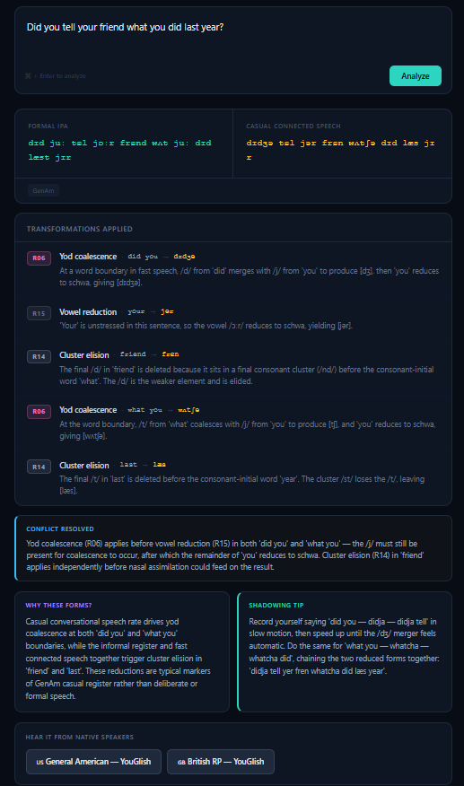
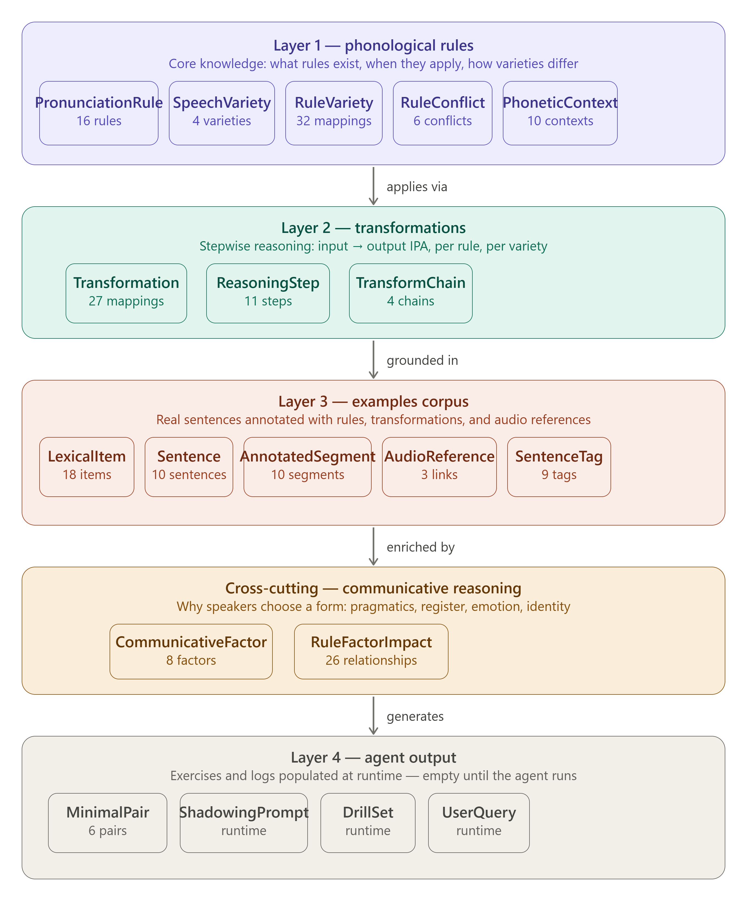
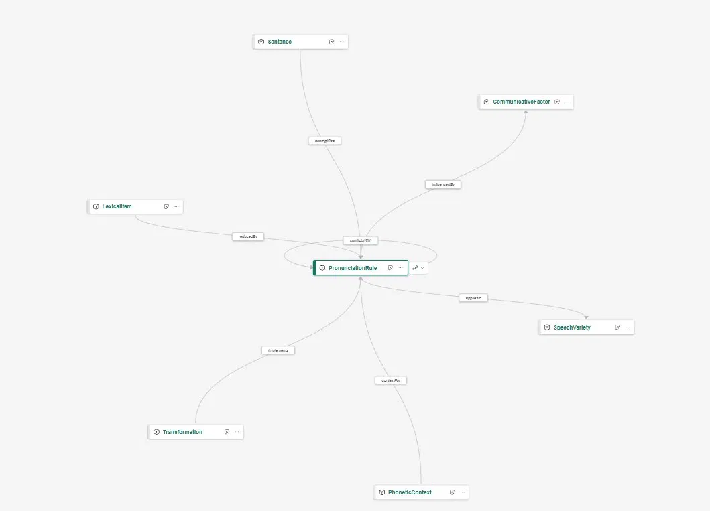

# IPA Reasoning Coach

> An AI agent that explains connected speech, IPA transformations, and pronunciation patterns through reasoning — not just transcription.

**Hackathon:** Microsoft Agents League 2026
**Track:** Reasoning Agents
**Microsoft IQ Layer:** Fabric IQ (Ontology + Data Agent)

---

## Table of Contents

- [The Problem](#the-problem)
- [What It Does](#what-it-does)
- [Two Interfaces, One Knowledge Model](#two-interfaces-one-knowledge-model)
- [Architecture](#architecture)
- [Knowledge Model](#knowledge-model)
- [Ontology (Fabric IQ)](#ontology-fabric-iq)
- [The 16 Phonological Rules](#the-16-phonological-rules)
- [Setup](#setup)
- [Reasoning Evaluation](#reasoning-evaluation)
- [Current Limitations and Roadmap](#current-limitations-and-roadmap)
- [Why This Is Different From Generic Chatbots](#why-this-is-different-from-generic-chatbots)
- [Project Files](#project-files)
- [Built With](#built-with)

---

## The Problem

Native English speakers never need to think about why "butter" sounds like "budder" or why "should have" becomes "shoulda" — these patterns are automatic and invisible to them.

For non-native English learners, especially those at C1/C2 level, this invisibility is the final barrier to true fluency. They understand textbook English perfectly but struggle with real spoken English at natural speed — podcasts, movies, casual conversation — because nobody ever explained the underlying rules of connected speech.

The gap between understanding English and *hearing* English the way natives speak it is almost entirely phonological. It is not a vocabulary gap or a grammar gap. It is a connected speech gap.

IPA Reasoning Coach exists for that learner: the person who is technically advanced but frustrated because real spoken English still feels like a different language from what they studied.

---

🎥 Demo Video: https://youtu.be/8pRitv5Arro

---

## What It Does

Most pronunciation tools tell you *what* a word sounds like. IPA Reasoning Coach tells you *why* it sounds that way — and *why a speaker chose that form* in that specific communicative context.

Given any English sentence, the agent:

1. Detects which phonological rules apply to each segment
2. Resolves conflicts when two rules compete on the same sound
3. Applies transformations in the correct order
4. Generates both formal IPA and casual connected-speech IPA
5. Explains each transformation in plain language
6. Reasons about the communicative factors that drove the speaker's choices

**Example input:** `"I should have known better"`

**Agent output:**
- Formal IPA: `[aɪ ʃʊd hæv noʊn ˈbɛtɚ]`
- Casual IPA: `[aɪ ˈʃʊɾə noʊn ˈbɛɾɚ]`
- Rules applied: shoulda reduction (R13), flapping (R01)
- Why: *"The speaker likely used 'shoulda' because the context is informal and emotionally charged — shoulda/woulda/coulda are strongly associated with regret and frustration. Flapping applies to 'better' because /t/ is intervocalic with the second syllable unstressed, a core GenAm feature."*

---

## Two Interfaces, One Knowledge Model

The project has two complementary components that share the same phonological knowledge:

### Microsoft Fabric Data Agent

The primary component. Lives in a Fabric workspace with F2 capacity. Has access to all 19 Delta tables and the Fabric IQ ontology. Reasons over structured data — when asked why a speaker uses "shoulda", it traverses the graph from `PronunciationRule` through `RuleFactorImpact` to `CommunicativeFactor` and cites specific rows. The reasoning is traceable to data, not to model weights.

Limitation: the Fabric Data Agent UI renders plain text — links are not clickable and output has no visual formatting.

### Claude-powered Artifact

A standalone React interface that calls the Claude API directly using the same phonological rules encoded in a system prompt. Designed for the learner experience: IPA transcriptions in color (formal in teal, casual in amber), transformation badges per rule, and YouGlish links as real clickable buttons.



This component does not connect to the Lakehouse or ontology — it uses the LLM's reasoning directly. The vision for the full product is a single interface that calls the Fabric Data Agent via API and renders its structured output with this visual layer.

| | Fabric Data Agent | Claude Artifact |
|---|---|---|
| Knowledge source | 19 Delta tables + Fabric IQ ontology | System prompt |
| Reasoning | Over structured data, traceable to rows | LLM directly |
| Interface | Plain text chat | Visual UI with clickable links |
| Requires F2 capacity | Yes | No |

Together they demonstrate what the full product would look like: structured phonological knowledge in a graph, consumed by an agent, presented through a learner-focused interface.

---

## Architecture

```
User input (any English sentence)
         │
         ▼
  Microsoft Fabric Data Agent
         │
         ├── IPACoachOntology (Fabric IQ)
         │     7 entity types + 8 relationship types
         │     Semantic reasoning over phonological knowledge
         │
         └── IPACoachLH (Lakehouse)
               19 Delta tables
               Phonological rules, transformations, examples, pragmatic factors
```

The agent combines structured knowledge from the Lakehouse with semantic graph reasoning from the Fabric IQ Ontology to produce traceable, rule-based explanations — not generic language model outputs.

### Data model layers



### Ontology graph



---

## Knowledge Model

The data model has 5 layers across 19 Delta tables, designed so the agent reasons from rules rather than memorizing examples.

### Layer 1 — Phonological Rules

| Table | Purpose | Rows |
|---|---|---|
| `PronunciationRule` | 16 phonological rules with formal and informal descriptions, CEFR level, frequency, and confidence score | 16 |
| `SpeechVariety` | English varieties (GenAm, RP, AuE, CanE) | 4 |
| `RuleVariety` | Bridge: which rules apply in which variety (primary / secondary / absent) | 32 |
| `RuleConflict` | Explicit conflict resolution: when two rules compete, which wins and why | 6 |
| `PhoneticContext` | Environments that trigger or block each rule, including negative contexts | 10 |

### Layer 2 — Transformations

| Table | Purpose | Rows |
|---|---|---|
| `Transformation` | Concrete input→output IPA mappings per rule per variety | 27 |
| `ReasoningStep` | Step-by-step reasoning trace for a full sentence (detect → conflict_check → apply → explain → verify) | 11 |
| `TransformChain` | Consolidated formal and casual IPA per sentence per variety | 4 |

### Layer 3 — Examples Corpus

| Table | Purpose | Rows |
|---|---|---|
| `LexicalItem` | Reduced forms (gonna, wanna, shoulda) with frequency rank and CEFR level | 18 |
| `Sentence` | Annotated example sentences across registers and CEFR levels | 10 |
| `AnnotatedSegment` | Each word/phrase span mapped to the rule it triggers, with application priority | 10 |
| `AudioReference` | YouGlish links for shadowing practice | 3 |
| `SentenceTag` | Flexible tagging by rule focus, difficulty, and topic | 9 |

### Cross-cutting — Communicative Reasoning

| Table | Purpose | Rows |
|---|---|---|
| `CommunicativeFactor` | 8 pragmatic factors: formality, speech rate, emphasis, emotional state, regional identity, audience design, fatigue, genre | 8 |
| `RuleFactorImpact` | 26 explicit relationships: how each factor increases, decreases, blocks, or triggers each rule | 26 |

### Layer 4 — Agent Output

| Table | Purpose | Rows |
|---|---|---|
| `MinimalPair` | Contrast pairs: formal vs casual, GenAm vs RP | 6 |
| `ShadowingPrompt` | Generated shadowing exercises (populated at runtime) | 0 |
| `DrillSet` | Grouped drills by rule and variety (populated at runtime) | 0 |
| `UserQuery` | Interaction log for continuous improvement (populated at runtime) | 0 |

---

## Ontology (Fabric IQ)

The ontology sits on top of the Lakehouse and gives the agent semantic graph reasoning.

**7 Entity types:**
`PronunciationRule`, `SpeechVariety`, `PhoneticContext`, `Transformation`, `LexicalItem`, `Sentence`, `CommunicativeFactor`

**8 Relationship types:**

| Relationship | From | To | Bridge table |
|---|---|---|---|
| `appliesIn` | PronunciationRule | SpeechVariety | RuleVariety |
| `conflictsWith` | PronunciationRule | PronunciationRule | RuleConflict |
| `contextFor` | PhoneticContext | PronunciationRule | PhoneticContext |
| `implements` | Transformation | PronunciationRule | Transformation |
| `forVariety` | Transformation | SpeechVariety | Transformation |
| `reducedBy` | LexicalItem | PronunciationRule | LexicalItem |
| `influencedBy` | PronunciationRule | CommunicativeFactor | RuleFactorImpact |
| `exemplifies` | Sentence | PronunciationRule | AnnotatedSegment |

With the ontology, the agent can answer questions like *"what communicative factors influence flapping?"* by traversing the graph — without needing a handcrafted SQL join.

---

## The 16 Phonological Rules

| ID | Rule | Category | Variety | Frequency |
|---|---|---|---|---|
| R01 | Flapping | Connected speech | GenAm | High |
| R02 | T-glottalization | Connected speech | RP | High |
| R03 | H-dropping | Connected speech | Both | High |
| R04 | Linking-R | Connected speech | RP | High |
| R05 | Intrusive-R | Connected speech | RP | Medium |
| R06 | Yod coalescence | Assimilation | Both | High |
| R07 | Nasal assimilation | Assimilation | Both | Medium |
| R08 | Weak forms | Weak forms | Both | High |
| R09 | Contractions | Weak forms | Both | High |
| R10 | Gonna reduction | Weak forms | GenAm | High |
| R11 | Wanna reduction | Weak forms | GenAm | High |
| R12 | Gotta reduction | Weak forms | GenAm | High |
| R13 | Shoulda/Woulda/Coulda | Weak forms | Both | Medium |
| R14 | Consonant cluster elision | Elision | Both | High |
| R15 | Vowel reduction | Vowel reduction | Both | High |
| R16 | Smoothing | Vowel reduction | RP | Medium |

---

## Setup

### Prerequisites

- Microsoft Fabric workspace with F2 capacity or higher
- Fabric tenant settings enabled:
  - Users can create Ontology (preview) items
  - Users can create Graph
  - Users can create and share data agent item types
  - Copilot and Azure OpenAI features enabled

### Step 1 — Create the Lakehouse and tables

Run `ipa_coach_setup.ipynb` in your Fabric workspace.

The notebook is idempotent — safe to re-run. It:
1. Creates `IPACoachLH` if it does not exist (or finds the existing one)
2. Writes all 19 Delta tables with seed data
3. Validates row counts for all tables

**Important:** The first cell (`%pip install semantic-link`) will trigger a kernel restart. Run it again after the restart — on the second run the kernel will not restart and variables will be available for subsequent cells.

### Step 2 — Create the Ontology

**Option A — Notebook (programmatic):**

Run `ipa_coach_ontology.ipynb`. This POSTs the complete ontology definition via the Fabric REST API.

Note: If your tenant returns `UnsupportedItemType: Ontology`, use Option B instead and verify the required tenant settings are enabled.

**Option B — Manual via Fabric UI:**

1. In your workspace, create a new **Ontology (preview)** item named `IPA_Coach_Ontology`
2. Add the 7 entity types, each bound to its Lakehouse table:

| Entity type | Table | Key | Display name |
|---|---|---|---|
| PronunciationRule | PronunciationRule | rule_id | rule_name |
| SpeechVariety | SpeechVariety | variety_id | variety_name |
| PhoneticContext | PhoneticContext | context_id | environment_desc |
| Transformation | Transformation | transform_id | input_segment |
| LexicalItem | LexicalItem | word_id | lemma |
| Sentence | Sentence | sentence_id | raw_text |
| CommunicativeFactor | CommunicativeFactor | factor_id | factor_name |

3. Add the 8 relationships using the bridge tables specified in the [Ontology](#ontology-fabric-iq) section above

### Step 3 — Create the Data Agent

1. In your workspace, create a new **Data Agent** item
2. Add `IPA_Coach_Ontology` as a data source
3. Paste the agent instructions from `agent_instructions.txt` into the Instructions field
4. Save and test

---

## Reasoning Evaluation

These test queries were used to evaluate the agent's reasoning depth. They are not arbitrary — each targets a specific table or reasoning capability.

### Test 1 — Conflict resolution
> *"In 'button' and 'butter', why does the /t/ behave differently in each word?"*

**What it tests:** `RuleConflict` — whether the agent can distinguish intervocalic flapping (R01 wins in butter) from pre-syllabic-/n/ context (R02 wins in button).

**Why it matters:** A naive transcription tool gives you the right output by lookup. This agent must reason that flapping is *blocked* in "button" by the syllabic /n/ environment — and cite the priority rule.

### Test 2 — Cross-variety differences
> *"Pronounce 'I have no idea of the answer' in both General American and British RP, and explain every difference."*

**What it tests:** `RuleVariety` — the agent must identify three simultaneous differences: rhoticity, linking-R in RP for "idea of", and the absence of linking-R in GenAm.

**Why it matters:** Learners often study one variety and are confused by the other. The agent must reason from variety-specific rule applicability, not generic rules.

### Test 3 — Negative reasoning (blocked rules)
> *"Why doesn't flapping apply to the word 'today' or 'attend'?"*

**What it tests:** `PhoneticContext` with `blocks_rule=True` — the agent must explain that /t/ in onset position of a stressed syllable *blocks* flapping, not merely that flapping doesn't apply.

**Why it matters:** Knowing when a rule applies is half the model. Knowing why it *doesn't* apply in a specific context is what distinguishes rule-based reasoning from pattern matching.

### Test 4 — Pragmatic factor reasoning
> *"A CEO is giving a speech at a formal conference. Which pronunciation rules would they suppress and which would they keep?"*

**What it tests:** `RuleFactorImpact` with `effect: decreases/blocks` for the `formality` factor — the agent must reason about which rules are suppressed by high formality and which survive.

**Why it matters:** This is the `influencedBy` relationship in the ontology doing real work. The answer requires traversing PronunciationRule → CommunicativeFactor via RuleFactorImpact, reasoning about effects, and synthesizing a coherent response about register.

### Test 5 — Scope honesty (prosody boundary)
> *"'I didn't say SHE stole the money' vs 'I didn't say she stole the MONEY' — how does stress change meaning?"*

**What it tests:** Whether the agent correctly identifies its own limits. Nuclear stress and intonation are outside the current model scope.

**Why it matters:** A well-designed agent should know what it doesn't know. The agent correctly analyzes the connected speech layer it can handle, explains that nuclear stress is prosodic and outside its scope, and offers to help further — without hallucinating an answer.

### Test 6 — Generalization to unseen sentences
> *"How would a native speaker say 'I should have put it in the database' in a casual tech conversation?"*

**What it tests:** Whether the agent generalizes rules to sentences never seen in the corpus. This sentence does not exist in `Sentence` or `TransformChain`.

**Why it matters:** The model has only 10 example sentences. Its value comes from reasoning from rules — not from retrieval. This test confirms the agent applies shoulda reduction, multiple flapping instances, weak forms, and vowel reduction to a completely new input.

### Test 7 — Contextual consistency
> First: *"How do you pronounce 'want to'?"*
> Then: *"And 'want to' in a job interview?"*

**What it tests:** Whether the `formality` factor in `CommunicativeFactor` produces consistent, context-sensitive responses across a conversation.

**Why it matters:** The same phonological form should produce different recommendations depending on communicative context. The agent correctly gives wanna for casual and [wɑnt tu] for formal, with explicit reasoning about why formality suppresses the reduction.

---

## Current Limitations and Roadmap

### What the current model does not cover

**Prosody** is the most significant gap. The agent handles segmental phonology (individual sounds and their changes) but not suprasegmental features:
- Nuclear stress and focus (which word carries the main stress in a phrase)
- Intonation patterns (rising vs falling contours for questions, statements, lists)
- Rhythm and stress timing (English as a stress-timed language)
- Tone groups and thought group boundaries

This limitation was addressed at the agent instruction level — the system prompt explicitly tells the agent to acknowledge prosody as out of scope and offer what segmental analysis it can. This is intentional design: the agent is honest about its boundaries rather than hallucinating prosodic analysis.

**Planned additions to the data model for prosody:**
- New category in `PronunciationRule`: `prosody`
- New columns in `PhoneticContext`: `phrase_position`, `information_status`
- New `CommunicativeFactor` entries: `information_focus`, `contrast`, `topic_boundary`
- Updates to `Transformation`: duration and pitch markup using IPA diacritics

### Known limitations found during testing

These limitations were discovered by deliberately stress-testing the agent against edge cases. They are documented here because finding where a model fails is as important as showing where it succeeds.

**Consecutive flapping chains**
When two or more adjacent segments trigger flapping in rapid succession (e.g. "get rid of it"), the agent may collapse them into a single flap event rather than tracing each independently. In "get rid of it", the /t/ in "get" and the /d/ in "rid" should each produce separate flaps — [ɡɛɾ ɹɪɾ əv ɪt] — but the agent merged them into [ɡɛɾ̬əv], effectively dropping "rid" from the analysis. Corrected by adding explicit multi-flap chain examples to `AnnotatedSegment` and `Transformation`.

**Voicing assimilation on weak-form prepositions**
In "a quarter to eight", the agent incorrectly converted the weak form "to" from [tə] to [də], treating it as a flapping or voicing event. The weak form of "to" before a vowel-initial word is [tə] and does not undergo voicing assimilation. This reveals a gap in `PhoneticContext` data for prepositions in pre-vowel position.

**Uncovered varieties (AuE, CanE, and others)**
When asked to analyze Australian English, the agent attempted a response instead of acknowledging that AuE is outside its current scope. The updated agent instructions now explicitly block analysis of varieties with no rule coverage. The schema is designed for extensibility — adding a new variety requires only new rows in `SpeechVariety`, `RuleVariety`, and `PronunciationRule`, with no schema changes.

**Planned testing**
These three limitations were found in initial stress testing. Further edge cases are expected with additional testing, particularly around consonant cluster interactions at phrase boundaries, h-dropping in sentence-initial position, and nasal assimilation feeding into cluster elision chains.

### YouGlish dynamic links

For every sentence analyzed, the agent automatically generates two YouGlish links so the learner can hear real native speakers say the same phrase in context:

- 🇺🇸 GenAm: `https://youglish.com/pronounce/{sentence}/english/us`
- 🇬🇧 RP: `https://youglish.com/pronounce/{sentence}/english/uk`

Links are constructed dynamically for any input sentence — not limited to the 10 example sentences in the corpus.

### Other planned improvements

- **More example sentences** in `Sentence` and `AnnotatedSegment` — particularly for business English, academic English, and fast casual conversation
- **Audio references** for all 10 example sentences (currently only 3 have YouGlish links)
- **Australian and Canadian English** rules — schema is ready, only new rows needed
- **User history** via `UserQuery` — tracking which rules a specific learner struggles with most to generate personalized drill sets
- **DrillSet population** — currently empty, to be filled by the agent at runtime based on learner history

---

## Why This Is Different From Generic Chatbots

General-purpose language models know phonology from training data, but they:
- Do not have an explicit, inspectable rule model
- Cannot show which rule took priority over another in a conflict
- Cannot reason about why a speaker chose a form based on communicative factors
- Cannot be extended with new rules or varieties without retraining

IPA Reasoning Coach separates the *knowledge* (Delta tables + ontology) from the *reasoning engine* (Data Agent). Rules can be added, corrected, or extended independently. The agent's reasoning is traceable to specific rows in specific tables — not to opaque model weights.

---

## Project Files

| File | Description |
|---|---|
| `ipa_coach_setup.ipynb` | Creates IPACoachLH and writes all 19 Delta tables with seed data |
| `ipa_coach_ontology.ipynb` | POSTs IPACoachOntology via Fabric REST API (programmatic route) |
| `ipa_reasoning_coach.jsx` | Standalone React interface with visual IPA output and clickable YouGlish links |
| `agent_instructions.txt` | Full system prompt for the Data Agent (16 rules + conflict resolution + pragmatic factors) |
| `README.md` | This file |

---

## Built With

- **Microsoft Fabric** — Lakehouse (Delta tables), Fabric IQ Ontology, Data Agent
- **Azure OpenAI** — Reasoning engine behind the Data Agent
- **PySpark** — Data ingestion and table creation
- **Fabric REST API** — Programmatic ontology creation
- **OneLake** — Unified storage for all Delta tables
- **Claude API** — Powering the standalone learner interface

---

*Submitted to Microsoft Agents League Hackathon 2026 — Reasoning Agents track*
